# Scan Pay #
Scan Pay is an Android app developed to address the issue of waiting in queues at the checkout counters. Using the app a customer can scan the QR code mentioned against the product to add it directly in the app's cart and make payment using in-app UPI apps. The payment a QR code is generated which can be scanned by store's staff for simple and easy checkout.

## Features of User App ##
1. User Authentication and Profile Creation and management
2. Browse nearby stores that provide this facility, with navigate to location using Google Maps
3. Scan Shop's QR code to start the shopping session
4. Add items in the cart by scanning the QR code of the product
5. Cart Management - Increase/Decrease quantity or delete item from cart
6. Payment using in-app UPI apps
7. Invoice generation
8. Verification QR generation to verify the purchase at checkout counter

## User App Preview ##
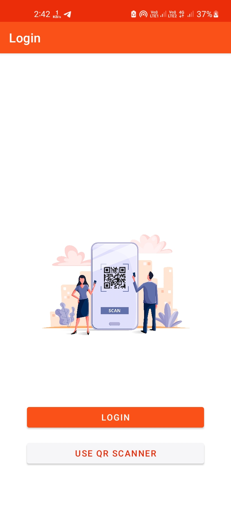 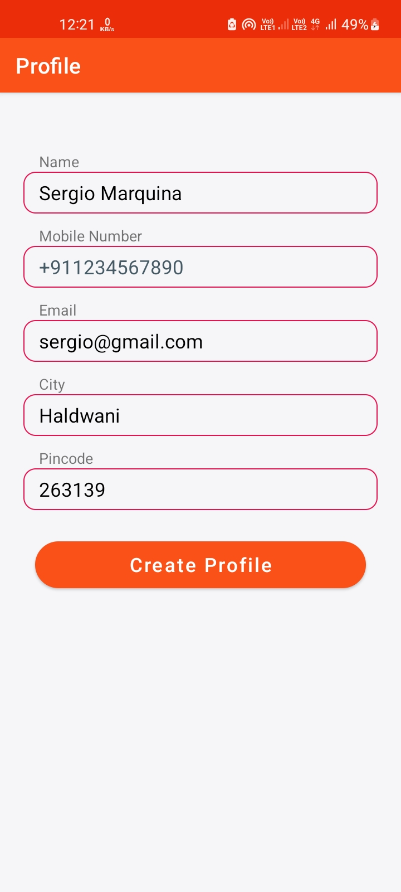
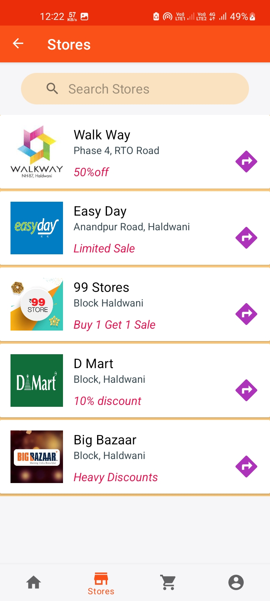
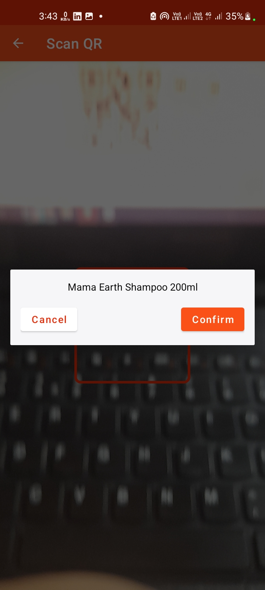
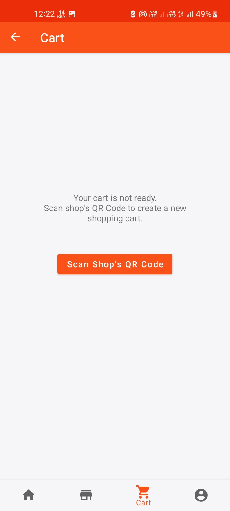
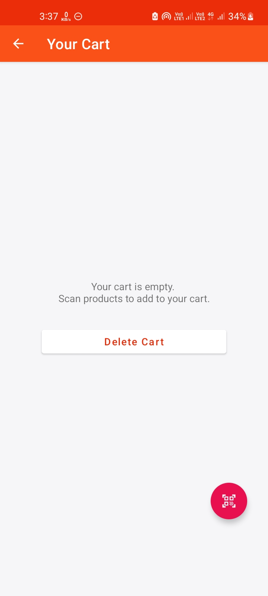
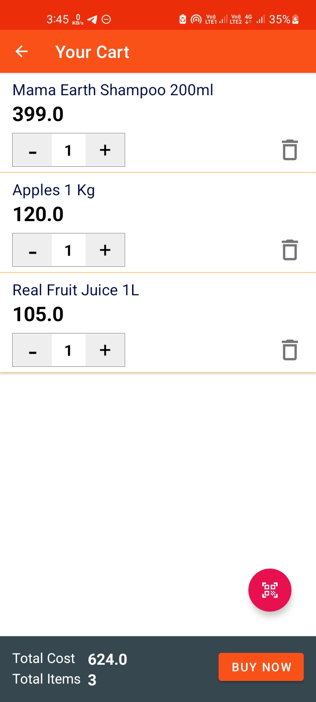

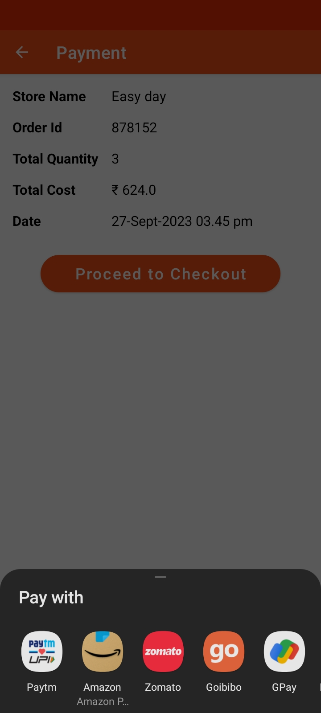
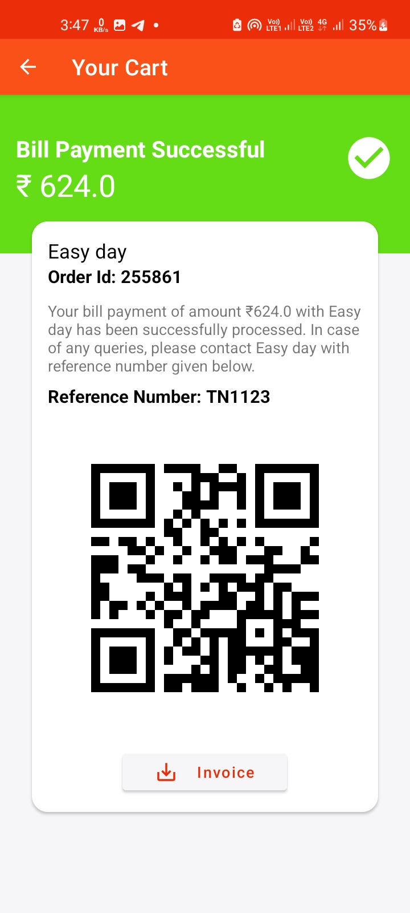
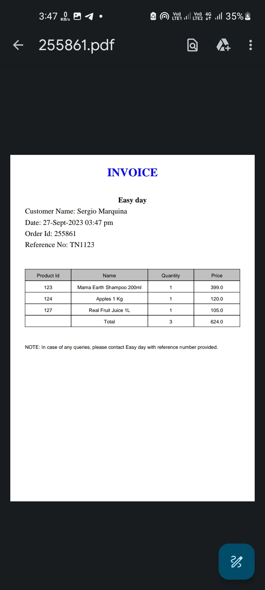
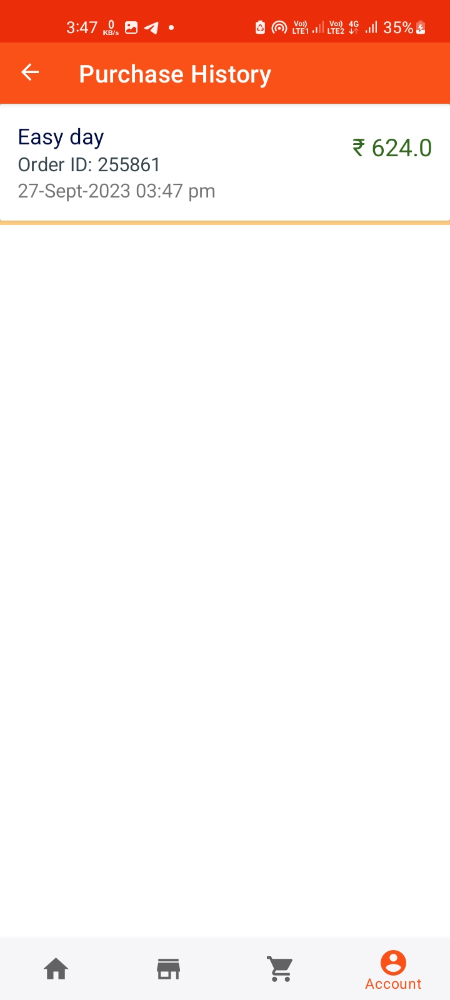

## Features of Partner App ##
1. Store listing and store profile creation and management
2. Scanning receipt's QR code to verify purchase
3. Invoice downloading for the order
4. Orders and Sales Tracking

## Partner App Preview ##

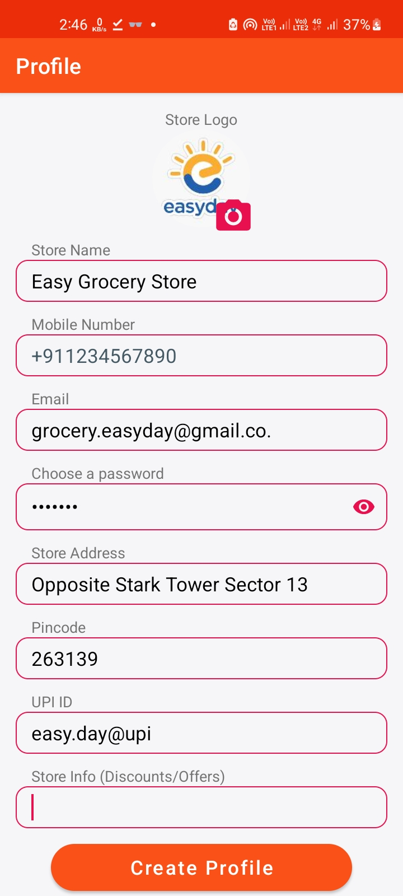 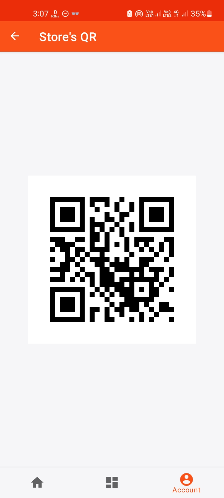
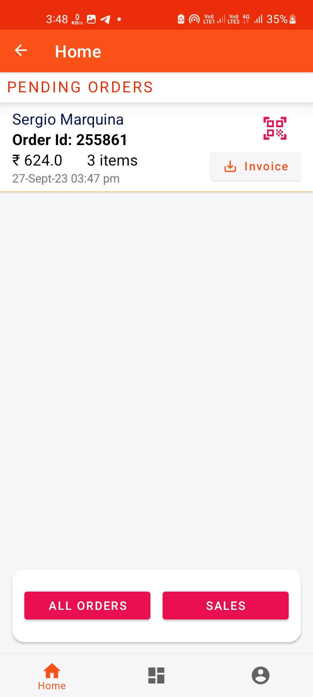
